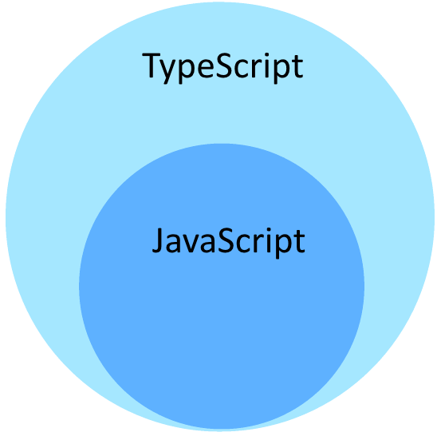

# Angular-8 Interview Questions & Answers

> Click :star:if you like the project. Pull Request are highly appreciated.

### Table of Contents

| No. | Questions |
|---- | ---------
| <span id="Q1">1</span> | [What is Angular 8?](#what-is-angular-8)|
| <span id="Q2">2</span> | [What is new in Angular 8?](#what-is-new-in-angular-8)|
| <span id="Q3">3</span> | [What are the building blocks of Angular?](#what-are-the-building-blocks-of-angular)|
| <span id="Q4">4</span> | [Which command is used to create service?](#Which-command-is-used-to-create-service)|
| <span id="Q5">5</span> | [What is use of `ngIf` directive?](#What-is-use-of-ngIf-directive)|
| <span id="Q6">6</span> | [What is use of `ngSwitch` directive?](#What-is-use-of-ngSwitch-directive)|
| <span id="Q7">7</span> | [What is use of `ngFor` directive?](#What-is-use-of-ngFor-directive)|
| <span id="Q8">8</span> | [What is use of `ngClass` directive?](#What-is-use-of-ngClass-directive)|
| <span id="Q9">9</span> | [What is use of `ngStyle` directive?](#What-is-use-of-ngStyle-directive)|
| <span id="Q10">10</span> | [What is Angular CLI?](#What-is-Angular-CLI)|
| <span id="Q11">11</span> | [How to install angular CLI?](#How-to-install-angular-CLI)|
| <span id="Q12">12</span> | [What are IDEs that can be used to develop angular application?](#What-are-IDEs-that-can-be-used-to-develop-angular-application)|
| <span id="Q13">13</span> | [What is `src` and `app` folder?](#What-is-src-and-app-folder)|
| <span id="Q14">14</span> | [What is `e2e` folder?](#What-is-e2e-folder)|
| <span id="Q15">15</span> | [How to use bootstrap with angular?](#How-to-use-bootstrap-with-angular)|
| <span id="Q16">16</span> | [Difference between npm start and ng serve?](#Difference-between-npm-start-and-ng-serve)|
| <span id="Q17">17</span> | [Explain Angular application flow.](#Explain-Angular-application-flow)|
| <span id="Q18">18</span> | [What is app-root?](#What-is-app-root)|
| <span id="Q19">19</span> | [What is Module?](#What-is-Module)|
| <span id="Q20">20</span> | [How to create component from CLI?](#How-to-create-component-from-CLI)|
| <span id="Q21">21</span> | [How to use inline template in component?](#How-to-use-inline-template-in-component)|
| <span id="Q22">22</span> | [How to add style to your component in html which will be applicable to that particular component only?](#How-to-add-style-to-your-component-in-html-which-will-be-applicable-to-that-particular-component-only)|
| <span id="Q23">23</span> | [How to use selector as attribute?](#How-to-use-selector-as-attribute)|
| <span id="Q24">24</span> | [How to use selector as class?](#How-to-use-selector-as-class)|
| <span id="Q25">25</span> | [How to use selector as element?](#How-to-use-selector-as-element)|
| <span id="Q26">26</span> | [How to capture data emitted with event in event binding?](#How-to-capture-data-emitted-with-event-in-event-binding)|
| <span id="Q27">27</span> | [How to access property of child component from parent component?](#How-to-access-property-of-child-component-from-parent-component)|
| <span id="Q28">28</span> | [How to pass data from child component to parent component?](#How-to-pass-data-from-child-component-to-parent-component)|

----
  _Questions_ <a href="#Q1">**1**</a> | <a href="#Q2">**2**</a> | <a href="#Q3">**3**</a> | <a href="#Q4">**4**</a> | <a href="#Q5">**5**</a> | <a href="#Q6">**6**</a> | <a href="#Q7">**7**</a> | <a href="#Q8">**8**</a> | <a href="#Q9">**9**</a> | <a href="#Q10">**10**</a>
  ----

1. ### What is Angular 8?

    Angular is one of the **most popular** and **open source Front-end or Client-side scripting framework** for building Mobile and Desktop Apps. Angular is written in TypeScript language and It is compiled into JavaScript. Angular community has released the latest version Angular 8 on **28 May 2019**. This version contains some of new features, lot of performance and Workflow Improvements.

  **[⬆ Back to Top](#table-of-contents)**   |   <a href="#Q1">**⬆ Back to Question 1**</a>

----
  _Questions_ <a href="#Q1">**1**</a> | <a href="#Q2">**2**</a> | <a href="#Q3">**3**</a> | <a href="#Q4">**4**</a> | <a href="#Q5">**5**</a> | <a href="#Q6">**6**</a> | <a href="#Q7">**7**</a> | <a href="#Q8">**8**</a> | <a href="#Q9">**9**</a> | <a href="#Q10">**10**</a>
  ----

2. ### What is new in Angular 8?

    *  Angular Ivy :
        
        *  Ivy is the new compiler/runtime of Angluar available for testing.
        *  It is the latest rendering engine but not defualt engine for Angular 8.
        *  It generates smaller bundles; faster compilation.
        *  It translates the templates and components in HTML and JavaScript.
        *  You can enable Ivy in your project as below : 
        ` ng new angular-project --enable-ivy `

    *  Support for TypeScript (Higher Version) : 

        * It supports TypeScript 3.4; no version below 3.4.
        * It is superset of javascript.
            
        * Points out compilation errors at development time only.
        * Object oriented programming language.
        * Introduces strong typing.
        * Portable across browsers, devices and OS.
        * At the end, In Angular; Typescript is converted into Javascript.

    *  Support for Bazel :

        *  Bazel is build tool developed and used by Google.
        *  The angluar community is working to integrate Bazel tool in to the standard angular toolset to enable developers to perform faster builds on large projects.
        *  It allows to deploy only what has been changed.
        *  Opt-in Option with Angular 8.

    *  Support for Web Worker Bundling :

        * Web workers allow you to run CPU-intensive computations in a background thread, freeing the main thread to update the user interface. 
        * If you find your application performs a lot of computations, such as generating CAD drawings or doing heavy geometrical calculations, using web workers can help increase your application's performance.
        *  With Angular 8, you can now generate new web workers from the CLI. To add a worker to the project, you can run:
        ` ng generate webWorker my-worker `

    *  New changes in ViewChild and ContentChild
    *  Builder API and Workspace APIs in the CLI :
      
       ***_Builder APIs -_***
        * Angular 8 released new Builder APIs that allow you to tap into ng build, ng test and ng run to perform processes like build and deployment.
        * With Angular 8 you can try the latest version of AngularFire(The official Angular library for Firebase), which adds a deploy command, making build & deploy to Firebase easier than ever:
          * ` ng add @angular/fire `
          * ` ng run my-app:deploy `

        ***Workspace APIs -_***
         * Previously developers had to manually open and modify their angular.json to make changes to the workspace configuration.
         * With Angular 8.0, new APIs to make it easier to read and modify this file.

    *  Differential Loading by Default : 
        * Differential loading is a process by which the browser based on its own capabilities chooses between modern or legacy JavaScript.
        *  Creates two bundles which will be loaded according to the browser version and support : 
            1. ES6+ Bundle - For New browsers support; So that new browser loads less code to run the app in the browser.
            2. ES5 Bundle - For Old browsers support; So that old browser loads more code to run the app in the browser.

    *  Improvements in AngularJS Migration
    *  Lazy Loading with Dynamics Imports :

        *  Delay the loading of an object until it is required.
        *  Features loaded only when user the user navigates to their routes for the first time.
        *  Keeps the initial bundle size smaller; decreases load time. 
        *  Standard dynamic import syntax is  used.

        *   ```typescript
            const routes: Routes = [
            {
            path: 'items',
            loadChildren: () => import('./items/items.module').then(m => m.ItemsModule)
            }
            ];
            ```

    *  Opt-in usage sharing
    *  Angular Firebase
    *  Use of SVG as a template

**[⬆ Back to Top](#table-of-contents)**   |   <a href="#Q2">**⬆ Back to Question 2**</a>

----
  _Questions_ <a href="#Q1">**1**</a> | <a href="#Q2">**2**</a> | <a href="#Q3">**3**</a> | <a href="#Q4">**4**</a> | <a href="#Q5">**5**</a> | <a href="#Q6">**6**</a> | <a href="#Q7">**7**</a> | <a href="#Q8">**8**</a> | <a href="#Q9">**9**</a> | <a href="#Q10">**10**</a>
  ----

3. ### What are the building blocks of Angular?

    The Main Building blocks of Angular are
    *  Directives :

        * A directive modifies or manipulate the DOM by changing the appearance, behaviour or layout of DOM elements. Angular Directives are basically a **javaScript Class**.
        * There are 3 different directives:
          1. Component Directives
          2. Attribute Directives
          3. Structural Directives

    *  Modules : 

        *  Logical groupings of components, directives, services etc.

    *  Components :

        *  Basic building blocks of Angular.
        *  Made up of template, class and metadata.

    *  Meta Data :

        *  Tells Angular how to process a class. It is the information angular needs to decide if the particular class is a component, directive, service or just a regular class.
        * It is used to decorate a class using decorator.

    *  Templates : 

        *  UI/Views of an angular application; created using HTML.

    *  Data Binding : 
        
        *  Data binding is basically communication between Typescript code and template.
        *  Data binding is a core concept in Angular and allows to define communication between a component and the DOM, making it very easy to define interactive applications without worrying about pushing and pulling data. 
        *  There are four forms of data binding(divided as 3 categories) which differ in the way the data is flowing.
          
            1. **From the Component to the DOM:**

                1. **Interpolation:** {{ value }}: Adds the value of a property from the component
                    ```html
                    <li>Name: {{ user.name }}</li>
                    <li>Address: {{ user.address }}</li>
                    ```
                
                2. **Property binding:** [property]=”value”: The value is passed from the component to the specified property or simple HTML attribute
                    ```html
                    <input type="email" [value]="user.email">
                    ```
            2. **From the DOM to the Component:**
                
                1. **Event binding: (event)=”function”:** When a specific DOM event happens (eg.: click, change, keyup), call the specified method in the component
                    ```html
                    <button (click)="logout()"></button>
                    ```
            3. **Two-way binding:**
                
                1. **Two-way data binding:** [(ngModel)]=”value”: Two-way data binding allows to have the data flow both ways. For example, in the below code snippet, both the email DOM input and component email property are in sync
                    ```html
                    <input type="email" [(ngModel)]="user.email">
                    ```  

    *  Dependency Injection : 

        *  Dependency Injection is the technique in which classes receive thier dependencies from the external sources rathor than creating themselves.

    *  Services :

        *  Class with specific purpose.
        *  Used for sharing data, implementing application logic and interacting with external resoures.
        *  A service is used when a common functionality needs to be provided to various modules. Services allow for greater separation of concerns for your application and better modularity by allowing you to extract common functionality out of components.

    Let's create a repoService which can be used across components,

    ```typescript
    import { Injectable } from '@angular/core';
    import { Http } from '@angular/http';

    @Injectable({ // The Injectable decorator is required for dependency injection to work
      // providedIn option registers the service with a specific NgModule
      providedIn: 'root',  // This declares the service with the root app (AppModule)
    })
    export class RepoService{
      constructor(private http: Http){
      }

      fetchAll(){
        return this.http.get('https://api.github.com/repositories');
      }
    }
    ```
    The above service uses Http service as a dependency.  

**[⬆ Back to Top](#table-of-contents)**   |   <a href="#Q3">**⬆ Back to Question 3**</a>

----
  _Questions_ <a href="#Q1">**1**</a> | <a href="#Q2">**2**</a> | <a href="#Q3">**3**</a> | <a href="#Q4">**4**</a> | <a href="#Q5">**5**</a> | <a href="#Q6">**6**</a> | <a href="#Q7">**7**</a> | <a href="#Q8">**8**</a> | <a href="#Q9">**9**</a> | <a href="#Q10">**10**</a>
  ----


4. ### Which command is used to create service?

` ng gernerate service myservice `

The above command generates sleleton myservice class in

***_src/app/myservice.service.ts_***

**[⬆ Back to Top](#table-of-contents)**   |   <a href="#Q4">**⬆ Back to Question 4**</a>

----
  _Questions_ <a href="#Q1">**1**</a> | <a href="#Q2">**2**</a> | <a href="#Q3">**3**</a> | <a href="#Q4">**4**</a> | <a href="#Q5">**5**</a> | <a href="#Q6">**6**</a> | <a href="#Q7">**7**</a> | <a href="#Q8">**8**</a> | <a href="#Q9">**9**</a> | <a href="#Q10">**10**</a>
  ----


5. ### What is use of `ngIf` directive?

It is allows to add/remove the DOM element.

**[⬆ Back to Top](#table-of-contents)**   |   <a href="#Q5">**⬆ Back to Question 5**</a>

----
  _Questions_ <a href="#Q1">**1**</a> | <a href="#Q2">**2**</a> | <a href="#Q3">**3**</a> | <a href="#Q4">**4**</a> | <a href="#Q5">**5**</a> | <a href="#Q6">**6**</a> | <a href="#Q7">**7**</a> | <a href="#Q8">**8**</a> | <a href="#Q9">**9**</a> | <a href="#Q10">**10**</a>
  ----


6. ### What is use of `ngSwitch` directive?

It will enable us to add/remove DOM element. If is same as the switch statement of C#.

**[⬆ Back to Top](#table-of-contents)**   |   <a href="#Q6">**⬆ Back to Question 6**</a>

----
  _Questions_ <a href="#Q1">**1**</a> | <a href="#Q2">**2**</a> | <a href="#Q3">**3**</a> | <a href="#Q4">**4**</a> | <a href="#Q5">**5**</a> | <a href="#Q6">**6**</a> | <a href="#Q7">**7**</a> | <a href="#Q8">**8**</a> | <a href="#Q9">**9**</a> | <a href="#Q10">**10**</a>
  ----


7. ### What is use of `ngFor` directive?

It is used to repeat apart of HTML template once per each item from an iterable list.

**[⬆ Back to Top](#table-of-contents)**   |   <a href="#Q7">**⬆ Back to Question 7**</a>

----
  _Questions_ <a href="#Q1">**1**</a> | <a href="#Q2">**2**</a> | <a href="#Q3">**3**</a> | <a href="#Q4">**4**</a> | <a href="#Q5">**5**</a> | <a href="#Q6">**6**</a> | <a href="#Q7">**7**</a> | <a href="#Q8">**8**</a> | <a href="#Q9">**9**</a> | <a href="#Q10">**10**</a>
  ----


8. ### What is use of `ngClass` directive?

It is used to add/remove CSS Class.

**[⬆ Back to Top](#table-of-contents)**   |   <a href="#Q8">**⬆ Back to Question 8**</a>

----
  _Questions_ <a href="#Q1">**1**</a> | <a href="#Q2">**2**</a> | <a href="#Q3">**3**</a> | <a href="#Q4">**4**</a> | <a href="#Q5">**5**</a> | <a href="#Q6">**6**</a> | <a href="#Q7">**7**</a> | <a href="#Q8">**8**</a> | <a href="#Q9">**9**</a> | <a href="#Q10">**10**</a>
  ----


9. ### What is use of `ngStyle` directive?

It is used to modify the style of an HTML Element using expression and also used to change the styles of HTML Element dynamically.

**[⬆ Back to Top](#table-of-contents)**   |   <a href="#Q9">**⬆ Back to Question 9**</a>

----
  _Questions_ <a href="#Q1">**1**</a> | <a href="#Q2">**2**</a> | <a href="#Q3">**3**</a> | <a href="#Q4">**4**</a> | <a href="#Q5">**5**</a> | <a href="#Q6">**6**</a> | <a href="#Q7">**7**</a> | <a href="#Q8">**8**</a> | <a href="#Q9">**9**</a> | <a href="#Q10">**10**</a>
  ----


10. ### What is Angular CLI?

* The Angular CLI is a command-line interface tool that we use to
initialize, develop and maintain Angular applications.
* Creates Angular Application with single line commands.
* Some Angular CLI commands -

    *  ng new - generates new angular projects.
    *  ng build - compiles angular app and builds the project for production.
    *  ng generate - generates components, services, directives, routes, pipes etc.
    *  ng serve - Easily test app locally while development.
    *  ng test - run unit tests.

**[⬆ Back to Top](#table-of-contents)**   |   <a href="#Q10">**⬆ Back to Question 10**</a>

----
  _Questions_ <a href="#Q11">**11**</a> | <a href="#Q12">**12**</a> | <a href="#Q13">**13**</a> | <a href="#Q14">**14**</a> | <a href="#Q15">**15**</a> | <a href="#Q16">**16**</a> | <a href="#Q17">**17**</a> | <a href="#Q18">**18**</a> | <a href="#Q19">**19**</a> | <a href="#Q20">**20**</a>
  ----

11. ### How to install angular CLI?

* First install node.js
* Then, open node.js command prompt and issue command : 
  
  * ` npm
install –g @angular/cli `

**[⬆ Back to Top](#table-of-contents)**   |   <a href="#Q11">**⬆ Back to Question 11**</a>

----
  _Questions_ <a href="#Q11">**11**</a> | <a href="#Q12">**12**</a> | <a href="#Q13">**13**</a> | <a href="#Q14">**14**</a> | <a href="#Q15">**15**</a> | <a href="#Q16">**16**</a> | <a href="#Q17">**17**</a> | <a href="#Q18">**18**</a> | <a href="#Q19">**19**</a> | <a href="#Q20">**20**</a>
  ----

12. ### What are IDEs that can be used to develop angular application?

A few main IDEs are :
* Webstorm 
* Visual Studio Code
* Sublime

**[⬆ Back to Top](#table-of-contents)**   |   <a href="#Q12">**⬆ Back to Question 12**</a>

----
  _Questions_ <a href="#Q11">**11**</a> | <a href="#Q12">**12**</a> | <a href="#Q13">**13**</a> | <a href="#Q14">**14**</a> | <a href="#Q15">**15**</a> | <a href="#Q16">**16**</a> | <a href="#Q17">**17**</a> | <a href="#Q18">**18**</a> | <a href="#Q19">**19**</a> | <a href="#Q20">**20**</a>
  ----

13. ### What is `src` and `app` folder?

* In `src` folder - your project is created,
* In `app` folder - you can write your code using components, routes,
directives, services and pipes.

**[⬆ Back to Top](#table-of-contents)**   |   <a href="#Q13">**⬆ Back to Question 13**</a>

----
  _Questions_ <a href="#Q11">**11**</a> | <a href="#Q12">**12**</a> | <a href="#Q13">**13**</a> | <a href="#Q14">**14**</a> | <a href="#Q15">**15**</a> | <a href="#Q16">**16**</a> | <a href="#Q17">**17**</a> | <a href="#Q18">**18**</a> | <a href="#Q19">**19**</a> | <a href="#Q20">**20**</a>
  ----

14. ### What is `e2e` folder?

* It is required for end to end testing of angular application.

**[⬆ Back to Top](#table-of-contents)**   |   <a href="#Q14">**⬆ Back to Question 14**</a>

----
  _Questions_ <a href="#Q11">**11**</a> | <a href="#Q12">**12**</a> | <a href="#Q13">**13**</a> | <a href="#Q14">**14**</a> | <a href="#Q15">**15**</a> | <a href="#Q16">**16**</a> | <a href="#Q17">**17**</a> | <a href="#Q18">**18**</a> | <a href="#Q19">**19**</a> | <a href="#Q20">**20**</a>
  ----

15. ### How to use bootstrap with angular?

* Open terminal, navigate to project folder.
* Execute npm command: ` npm install --save bootstrap `
* Now verify if node_modules folder contain third party package
bootstrap that we have installed.
* In ` angular.json ` you can see **_styles_** array.
* Add below line to **_styles_** array so that bootstrap can be used in
project,

  ```json
  “styles”:[“../node_modules/bootstrap/dist/css/bootstrap.css”]
  ```

**[⬆ Back to Top](#table-of-contents)**   |   <a href="#Q15">**⬆ Back to Question 15**</a>

----
  _Questions_ <a href="#Q11">**11**</a> | <a href="#Q12">**12**</a> | <a href="#Q13">**13**</a> | <a href="#Q14">**14**</a> | <a href="#Q15">**15**</a> | <a href="#Q16">**16**</a> | <a href="#Q17">**17**</a> | <a href="#Q18">**18**</a> | <a href="#Q19">**19**</a> | <a href="#Q20">**20**</a>
  ----

16. ### Difference between npm start and ng serve?

* When you run “npm start” it will call whatever command written
inside ` “start” ` in ` package.json `.
  ```json
  “scripts”: {
  “ng”: “ng”,
  “start”: “ng serves”
  .
  .
  }
  ```
* For example: Above content in package.json will call ` “ng serve” `
when npm start command is executed.

**[⬆ Back to Top](#table-of-contents)**   |   <a href="#Q16">**⬆ Back to Question 16**</a>

----
  _Questions_ <a href="#Q11">**11**</a> | <a href="#Q12">**12**</a> | <a href="#Q13">**13**</a> | <a href="#Q14">**14**</a> | <a href="#Q15">**15**</a> | <a href="#Q16">**16**</a> | <a href="#Q17">**17**</a> | <a href="#Q18">**18**</a> | <a href="#Q19">**19**</a> | <a href="#Q20">**20**</a>
  ----

17. ### Explain Angular application flow.
* `main.ts` file
  ```typescript
  import { enableProdMode } from '@angular/core';
  import { platformBrowserDynamic } from '@angular/platform-browser-dynamic';

  import { AppModule } from './app/app.module';
  import { environment } from './environments/environment';

  if (environment.production) {
  enableProdMode();
  }

  platformBrowserDynamic().bootstrapModule(AppModule)
  .catch(err => console.error(err));
  ```
* The ` main.ts ` is the main file of angular application which
bootstraps the app. This main file bootstraps application with
default module as below:
```typescript
platformBrowserDynamic().bootstrapModule(AppModule);
```
* As you can see above “AppModule” is the default module which
will be picked up during application bootstrap.
* ` app.module.ts ` file
  ```typescript
  import { BrowserModule } from '@angular/platform-browser';
  import { NgModule } from '@angular/core';
  import { FormsModule } from '@angular/forms';
  import { HttpClientModule } from '@angular/common/http';

  import { AppComponent } from './app.component';
  // Registering persons component in app module.
  import { PersonsComponent } from './persons/persons.component';
  import { PersonInputComponent } from './persons/person-input.component';
  import { AppRoutingModule } from './app-routing.module';

  @NgModule({
  // the selector of persons component will look in all other component in the declarations.
    declarations: [
      AppComponent,
      PersonsComponent,
      PersonInputComponent
    ],
    imports: [
      BrowserModule,
      FormsModule,
      HttpClientModule,
      AppRoutingModule
    ],
    providers: [],
    bootstrap: [AppComponent]
    })
  export class AppModule { }
  ```
* The ` app.module.ts ` is the default module or you can create your
own modules. 

  * The AppModule is Typescript class with special
decorator or annotation @NgModule which tells angular CLI on
how to process this file. So this will be processed as module file
which will contain all of your Components, Services etc.
```typescript
Bootstrap: [AppComponent]
```
* Above property basically tells angular to bootstrap application with
the AppComponent which becomes default component.
* The AppComponent is picked up during application bootstrap
which is basically the default component of angular application.
* Component is basically view which you see in the browser.
* AppComponent is Typescript class with decorator “@Component”
which contain information about view and how to render
component. You can associate component with view using
“templateUrl” property of @Component decorator.

    * ` app.component.ts` file for **_metadata and application logic_**.
      ```typescript
      import { Component } from '@angular/core';

      @Component({
      selector: 'app-root',
      templateUrl: './app.component.html',
      styleUrls: ['./app.component.css']
      })
      export class AppComponent {
      title = 'Angular-Project';
      }
      ```
    * ` app.component.html ` file for **_view_**
      ```typescript
      <router-outlet></router-outlet>
      ```


**[⬆ Back to Top](#table-of-contents)**   |   <a href="#Q17">**⬆ Back to Question 17**</a>

----
  _Questions_ <a href="#Q11">**11**</a> | <a href="#Q12">**12**</a> | <a href="#Q13">**13**</a> | <a href="#Q14">**14**</a> | <a href="#Q15">**15**</a> | <a href="#Q16">**16**</a> | <a href="#Q17">**17**</a> | <a href="#Q18">**18**</a> | <a href="#Q19">**19**</a> | <a href="#Q20">**20**</a>
  ----

18. ### What is app-root?

* ` app-root ` is selector of app component which is placed as tag in
` index.html `.

```html
<!doctype html>
<html lang="en">
<head>
  <meta charset="utf-8">
  <title>AngularProject</title>
  <base href="/">
  <meta name="viewport" content="width=device-width, initial-scale=1">
  <link rel="icon" type="image/x-icon" href="favicon.ico">
</head>
<body>
  <app-root></app-root>
</body>
</html>
```

**[⬆ Back to Top](#table-of-contents)**   |   <a href="#Q18">**⬆ Back to Question 18**</a>

----
  _Questions_ <a href="#Q11">**11**</a> | <a href="#Q12">**12**</a> | <a href="#Q13">**13**</a> | <a href="#Q14">**14**</a> | <a href="#Q15">**15**</a> | <a href="#Q16">**16**</a> | <a href="#Q17">**17**</a> | <a href="#Q18">**18**</a> | <a href="#Q19">**19**</a> | <a href="#Q20">**20**</a>
  ----

19. ### What is Module?

* Angular uses **_module_** to bundle pieces i.e. components to packages. It gives angular information about functionalities i.e. components, pipes that application has.
* We use `@NgModule` to decorate module. We import `@NgModule` from `@angular/core`.
* To register component in module we can use `declarations` property of @NgModule and import it to tell Typescript its location. e.g.
* ```typescript
  @NgModule({
    imports: [
    BrowserModule,
    ],
    declarations: [AppComponent],
    bootstrap: [AppComponent]
    })
  ```
* Imports property is used to import other modules to current module.
* To create module from CLI :
  `ng generate module <name>`

**[⬆ Back to Top](#table-of-contents)**   |   <a href="#Q19">**⬆ Back to Question 19**</a>

----
  _Questions_ <a href="#Q11">**11**</a> | <a href="#Q12">**12**</a> | <a href="#Q13">**13**</a> | <a href="#Q14">**14**</a> | <a href="#Q15">**15**</a> | <a href="#Q16">**16**</a> | <a href="#Q17">**17**</a> | <a href="#Q18">**18**</a> | <a href="#Q19">**19**</a> | <a href="#Q20">**20**</a>
  ----

20. ### How to create component from CLI?

* `ng generate component <componentname>`
* Above command will create folder with `<componentname>` in app folder with ts, html, css, spec file.It will also add it to `declarations` property in `AppModule` and import it to the `AppModule`.

**[⬆ Back to Top](#table-of-contents)**   |   <a href="#Q20">**⬆ Back to Question 20**</a>

----
  _Questions_ <a href="#Q21">**21**</a> | <a href="#Q22">**22**</a> | <a href="#Q23">**23**</a> | <a href="#Q24">**24**</a> | <a href="#Q25">**25**</a> | <a href="#Q26">**26**</a> | <a href="#Q27">**27**</a> | <a href="#Q28">**28**</a> | <a href="#Q29">**29**</a> | <a href="#Q30">**30**</a>
  ----

21. ### How to use inline template in component?
* Use **_“template”_** instead of **_“templateUrl”_** in **@Component**
decorator. If you want to write multiline html code then use **`**
backtick with **“template”** property.

**[⬆ Back to Top](#table-of-contents)**   |   <a href="#Q21">**⬆ Back to Question 21**</a>

----
  _Questions_ <a href="#Q21">**21**</a> | <a href="#Q22">**22**</a> | <a href="#Q23">**23**</a> | <a href="#Q24">**24**</a> | <a href="#Q25">**25**</a> | <a href="#Q26">**26**</a> | <a href="#Q27">**27**</a> | <a href="#Q28">**28**</a> | <a href="#Q29">**29**</a> | <a href="#Q30">**30**</a>
  ----


22. ### How to add style to your component in html which will be applicable to that particular component only?

* This can be achieved by using **“styles”** instead of **“styleUrls”** property of @Component decorator, both properties accept array.
e.g.
```typescript
@Component({
Selector: ‘search’,
stylesUrls: [‘./search.component.less’],
..
})
```

**[⬆ Back to Top](#table-of-contents)**   |   <a href="#Q22">**⬆ Back to Question 22**</a>

----
  _Questions_ <a href="#Q21">**21**</a> | <a href="#Q22">**22**</a> | <a href="#Q23">**23**</a> | <a href="#Q24">**24**</a> | <a href="#Q25">**25**</a> | <a href="#Q26">**26**</a> | <a href="#Q27">**27**</a> | <a href="#Q28">**28**</a> | <a href="#Q29">**29**</a> | <a href="#Q30">**30**</a>
  ----


23. ### How to use selector as attribute?

* Enclose selector with square braces.
e.g.
```typescript
@Component({
selector: ‘[search]’,
..
})
```
* And then use it as html attribute. 
```html
<div search> </div>
```

**[⬆ Back to Top](#table-of-contents)**   |   <a href="#Q23">**⬆ Back to Question 23**</a>

----
  _Questions_ <a href="#Q21">**21**</a> | <a href="#Q22">**22**</a> | <a href="#Q23">**23**</a> | <a href="#Q24">**24**</a> | <a href="#Q25">**25**</a> | <a href="#Q26">**26**</a> | <a href="#Q27">**27**</a> | <a href="#Q28">**28**</a> | <a href="#Q29">**29**</a> | <a href="#Q30">**30**</a>
  ----


24. ### How to use selector as class?

* Add dot (.) at the start of selector name.
```typescript
@Component({
selector: ‘.search’,
. .
})
```
* And then use it in html as class.
```html
<div class=”search”> </div>
```

*Note : Using Selector as `id` is not allowed in angular.*

**[⬆ Back to Top](#table-of-contents)**   |   <a href="#Q24">**⬆ Back to Question 24**</a>

----
  _Questions_ <a href="#Q21">**21**</a> | <a href="#Q22">**22**</a> | <a href="#Q23">**23**</a> | <a href="#Q24">**24**</a> | <a href="#Q25">**25**</a> | <a href="#Q26">**26**</a> | <a href="#Q27">**27**</a> | <a href="#Q28">**28**</a> | <a href="#Q29">**29**</a> | <a href="#Q30">**30**</a>
  ----

25. ### How to use selector as element?

* Use selector property of @Component decorator.
e.g.
```typescript
@Component({
selector: ‘search’,
..
})
```
* And then use it as element in html. 
```html
<search></search>
```

**[⬆ Back to Top](#table-of-contents)**   |   <a href="#Q25">**⬆ Back to Question 25**</a>

----
  _Questions_ <a href="#Q21">**21**</a> | <a href="#Q22">**22**</a> | <a href="#Q23">**23**</a> | <a href="#Q24">**24**</a> | <a href="#Q25">**25**</a> | <a href="#Q26">**26**</a> | <a href="#Q27">**27**</a> | <a href="#Q28">**28**</a> | <a href="#Q29">**29**</a> | <a href="#Q30">**30**</a>
  ----

26. ### How to capture data emitted with event in event binding?

* We can capture data emitted with event in event binding using **$event** as method input,
e.g.
```html
<input type=”text” (input)=”onUpdat($event)”></input>
```
* Through $event data will be received in method with data type as “Event”.

**[⬆ Back to Top](#table-of-contents)**   |   <a href="#Q26">**⬆ Back to Question 26**</a>

----
  _Questions_ <a href="#Q21">**21**</a> | <a href="#Q22">**22**</a> | <a href="#Q23">**23**</a> | <a href="#Q24">**24**</a> | <a href="#Q25">**25**</a> | <a href="#Q26">**26**</a> | <a href="#Q27">**27**</a> | <a href="#Q28">**28**</a> | <a href="#Q29">**29**</a> | <a href="#Q30">**30**</a>
  ----

27. ### How to access property of child component from parent component?

* For this you can use **custom property binding**. 
* Lets Say `app` *component* is the parent component. and `child-element` *component* is the child component.
* In *app.component.html* file and then in **child-element component tag** use property to be used in square brackets[] as property binding assign value to it.
e.g.

* `app.component.html`
```html
...
<app-child-element [someproperty]=”true”></app-child-element>
...
```
* Then add decorator `@Input` to the child component property in Typescript file, otherwise property will not be accessible to outside components. 
* `child-element.component.ts`
```typescript
import { Input } from '@angular/core';
...
@Input someproperty;
...
```
* @Input is part of angular core. This is how custom property binding is done.

* In this case, we are passing data from parent component to child
component.

**[⬆ Back to Top](#table-of-contents)**   |   <a href="#Q27">**⬆ Back to Question 27**</a>

----
  _Questions_ <a href="#Q21">**21**</a> | <a href="#Q22">**22**</a> | <a href="#Q23">**23**</a> | <a href="#Q24">**24**</a> | <a href="#Q25">**25**</a> | <a href="#Q26">**26**</a> | <a href="#Q27">**27**</a> | <a href="#Q28">**28**</a> | <a href="#Q29">**29**</a> | <a href="#Q30">**30**</a>
  ----

28. ### How to pass data from child component to parent component?

* This can be achieved using event binding.
* Lets say `app` *component* is the parent component. and `child-element` *component* is the child component.
* Create properties in `child-element` *component* which is a child component and assign them EventEmitter in the `child-element.component.ts` file.

e.g.
```typescript
import { Component, EventEmitter } from '@angular/core';

@Component({
  selector: 'app-child-element',
  templateUrl: './child-element.component.html'
})
export class ChildElementComponent {
  onUpdate = new EventEmitter<>();
}
```
* Setup what event should emit using methods in child class.

e.g.
```diff
import { Component, EventEmitter } from '@angular/core';

@Component({
  selector: 'app-child-element',
  templateUrl: './child-element.component.html'
})

export class ChildElementComponent {
  onUpdate = new EventEmitter<>();
+  onUpdateMethod() {
+  this.onUpdate.emit({
+    propertyToBeEmitted: this.propertyToBeEmitted
+  });
+  }
}
```
* Add decorator @Output against property in child component.
e.g.
```diff
+ import { Component, EventEmitter, Output } from '@angular/core';

@Component({
  selector: 'app-child-element',
  templateUrl: './child-element.component.html'
})

export class ChildElementComponent {
+  @Output onUpdate = new EventEmitter<>();
  this.onUpdate.emit({
  onUpdateMethod() {
    propertyToBeEmitted: this.propertyToBeEmitted
  });
  }
}
```
* Use this event in parent html ie `app.component.html` with child component tag.
e.g.
```html
<app-child-element (onUpdate)=”onUpdateMethod($event)”></app-child-element>
```
**_Note_** : To use alias with event -
Pass argument to @output as
`@Output(‘someArgument’)`

**[⬆ Back to Top](#table-of-contents)**   |   <a href="#Q28">**⬆ Back to Question 28**</a>

----
  _Questions_ <a href="#Q21">**21**</a> | <a href="#Q22">**22**</a> | <a href="#Q23">**23**</a> | <a href="#Q24">**24**</a> | <a href="#Q25">**25**</a> | <a href="#Q26">**26**</a> | <a href="#Q27">**27**</a> | <a href="#Q28">**28**</a> | <a href="#Q29">**29**</a> | <a href="#Q30">**30**</a>
  ----

29. ### 

**[⬆ Back to Top](#table-of-contents)**   |   <a href="#Q29">**⬆ Back to Question 29**</a>